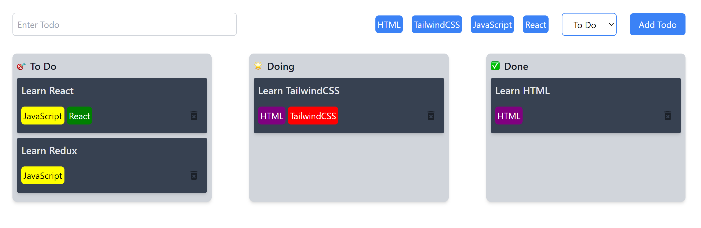

# Tasky App

Tasky is a simple task management application built using Vite, ReactJS, and Tailwind CSS. With Tasky, you can organize your tasks into three columns: To Do, Doing, and Done. You can also add tags to your tasks for better categorization.

![Tasky App Screenshot]!

## Features

- Add tasks to the To Do column.
- Assign tags to tasks.
- Delete tasks.
- User-friendly interface.
- Persist data to local storage using the useEffect() hook
```javaScript
 useEffect(() => {
    localStorage.setItem("tasks", JSON.stringify(tasks));
  }, [tasks]);
```

## Installation

To run Tasky locally on your machine, follow these steps:

1. **Clone the repository:**

   ```bash
   git clone https://github.com/your-username/tasky.git
   ```

2. **Navigate to the project directory:**

   ```bash
   cd tasky
   ```

3. **Install dependencies:**

   ```bash
   npm install
   ```

4. **Start the development server:**

   ```bash
   npm run dev
   ```

5. **Open your browser and access Tasky at [http://localhost:5173](http://localhost:5173)**

## Usage

- **Adding a Task:**
  - Enter the task description in the input field.
  - Select tags for the task (HTML, TailwindCSS, JavaScript, React).
  - Choose the task status (To Do, Doing, Done).
  - Click the "Add Todo" button.

- **Deleting a Task:**
  - Click the delete icon (trash can) next to a task to remove it from the list.


## Technologies Used

- [Vite](https://vitejs.dev/): A fast build tool for web development.
- [ReactJS](https://reactjs.org/): A JavaScript library for building user interfaces.
- [Tailwind CSS](https://tailwindcss.com/): A utility-first CSS framework for quickly styling web applications.

## Contributing

If you would like to contribute to Tasky, please follow these steps:

1. Fork the repository.
2. Create a new branch for your feature or bug fix: `git checkout -b feature-name`.
3. Make your changes and commit them: `git commit -m "Add new feature"`.
4. Push to your fork: `git push origin feature-name`.
5. Create a pull request to the `main` branch of the original repository.

## License

This project is licensed under the MIT License 

## Acknowledgments

- Thanks to the Vite, ReactJS, and TailwindCSS communities for their fantastic tools and documentation.

## Contact

If you have any questions or suggestions, please feel free to contact us:

- Email: isaacspaider@gmail.com
- GitHub: [Your GitHub Profile](https://github.com/isaacmuchunu)

Happy task management with Tasky! 🚀